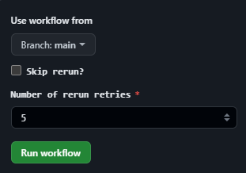
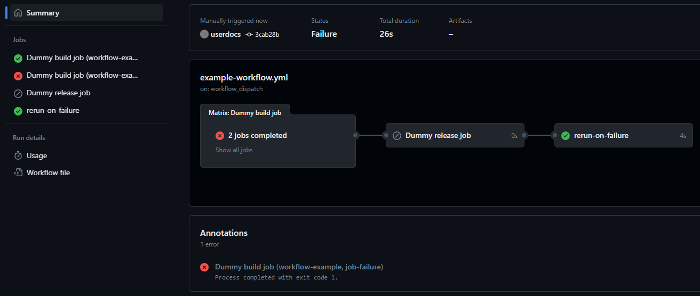
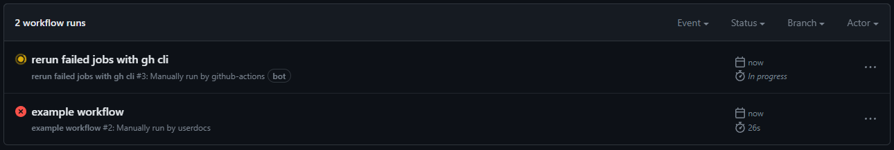
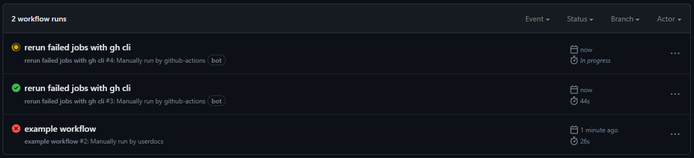
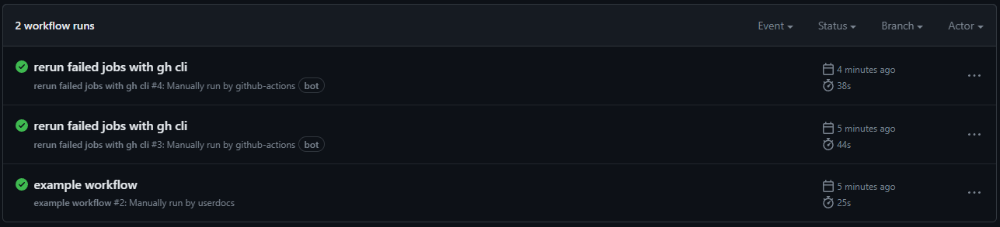
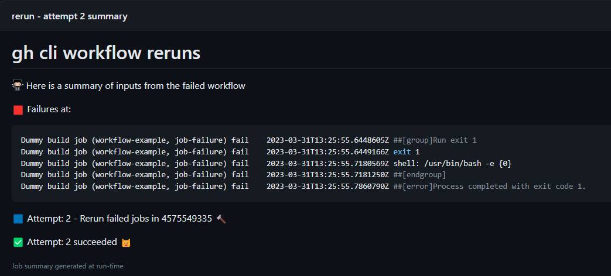

# gh cli workflow reruns

This is an example repo with a demonstration workflow to show how we can use just [gh cli](https://github.com/cli/cli) to trigger a rerun of failed jobs in a workflow using a drop in solution that only requires one customisation.

* [Actions overview](https://github.com/userdocs/gh-cli-workflow-reruns/actions)
* [example-workflow.yml](https://github.com/userdocs/gh-cli-workflow-reruns/blob/main/.github/workflows/example-workflow.yml)
* [rerun.yml](https://github.com/userdocs/gh-cli-workflow-reruns/blob/main/.github/workflows/rerun.yml)

### How the examples work

This example repo has a [matrix job](https://github.com/userdocs/gh-cli-workflow-reruns/blob/main/.github/workflows/example-workflow.yml) with two parts.

```yml
    strategy:
      fail-fast: false
      matrix:
        name: [workflow-example]
        conclusion: ["job-success", "job-failure"]
```

This matrix fails on the second matrix in the first job until it has been rerun twice, based on the `github.run_attempt` context

```yml
if: matrix.conclusion == 'job-failure' && github.run_attempt < 3
```

Otherwise the `rerun.yml` would attempt to rerun up to 5 times before it stops.

```yml
if: inputs.attempts < 5
```

It does this using this end of workflow job and triggering the workflow file `rerun.yml` if there were any failures `if:  failure()`

### The fundamental components

There are 3 main components of this to apply. They will be detailed and explained here.

#### Part 1

This goes at the start. It provides the core requirements to use the `rerun.yml` workflow such as `workflow_dispatch` and `inputs`

```yml
on:
  workflow_dispatch:
    inputs:
      skip_rerun:
        description: "Skip rerun?"
        required: true
        type: boolean
      retries:
        description: 'Number of rerun retries'
        required: true
        default: '5'
        type: choice
        options: [ "1", "2", "3", "4", "5", "6", "7", "8", "9" ]
```

🟦 When manually running the job via `workflow_dispatch` you can set two options.

* `skip_rerun` - a true or false (default false) options to bypass the rerun.
* `retries` - the number of retry attempts as a list of options, 1 to 9 times.



#### Part 2

This would go at the end of you workflow, as a separate job, that you want to make sure completes. It will call the `rerun.yml` and pass some critical inputs.

🟧 The one thing you need to make sure is customized is the `needs: release` to match the job name it is tracking. No other customizations are required.

```yml
  rerun-on-failure:
    if: failure() && inputs.skip_rerun == '0'
    name: rerun-on-failure
    needs: build
    permissions:
      actions: write
    runs-on: ubuntu-latest
    env:
      GH_TOKEN: "${{ secrets.GITHUB_TOKEN }}"
    steps:
      - uses: actions/checkout@v3
      - name: Trigger rerun workflow on job failures
        run: gh workflow run rerun.yml -f run_id=${{ github.run_id }} -f attempts=${{ github.run_attempt }}
```

🟨 Since we are using [gh cli](https://cli.github.com/manual/index) and not an action we can expand the potential of the job. One example is if you wanted to add more inputs to be passed you can add them like this

```
-f name=value
```

The just add it as an input in the `rerun.yml` and process it there and `${{ inputs.name }}`

#### Part 3

This unique workflow will then take the defined inputs and rerun the job, watch it to conclusion and provide a small job summary

```yaml
name: rerun failed jobs with gh cli

on:
  workflow_dispatch:
    inputs:
      run_id:
        required: true
      attempts:
        required: true
jobs:
  fml:
    name: rerun
    permissions:
      actions: write
    runs-on: ubuntu-latest
    env:
      GH_TOKEN: "${{ secrets.GITHUB_TOKEN }}"
    steps:
      - name: Host - Checkout action
        uses: actions/checkout@v3

      - name: gh cli rerun and summaries
        if: inputs.attempts < 5
        run: |
          failures="$(gh run view ${{ inputs.run_id }} --log-failed | sed "s,\x1B\[[0-9;]*[a-zA-Z],,g")"
          gh run rerun ${{ inputs.run_id }} --failed

          printf '%b\n' "# gh cli workflow reruns" >> $GITHUB_STEP_SUMMARY
          printf '\n%b\n' ":octocat: Here is a summary of inputs from the failed workflow" >> $GITHUB_STEP_SUMMARY
          printf '\n%b\n' "🟥 Failures at:\n\n\`\`\`log\n${failures}\n\`\`\`" >> $GITHUB_STEP_SUMMARY
          printf '\n%b\n' "🟦 Attempt: ${{ inputs.attempts }} - Rerun failed jobs in ${{ inputs.run_id }} :hammer:" >> $GITHUB_STEP_SUMMARY

          if gh run watch ${{ inputs.run_id }} --exit-status; then
              printf '\n%b\n' "✅ Attempt: ${{ inputs.attempts }} succeeded 😺" >> $GITHUB_STEP_SUMMARY
          else
              printf '\n%b\n' "❌ Attempt: ${{ inputs.attempts }} failed 😾" >> $GITHUB_STEP_SUMMARY
          fi
```

## Visual representation

Some images visually demonstrating the progress of the example.

#### First failure



#### First rerun attempt



#### Second rerun attempt



#### Jobs successfully completed with no failures



#### A helpful job summary

#### 
